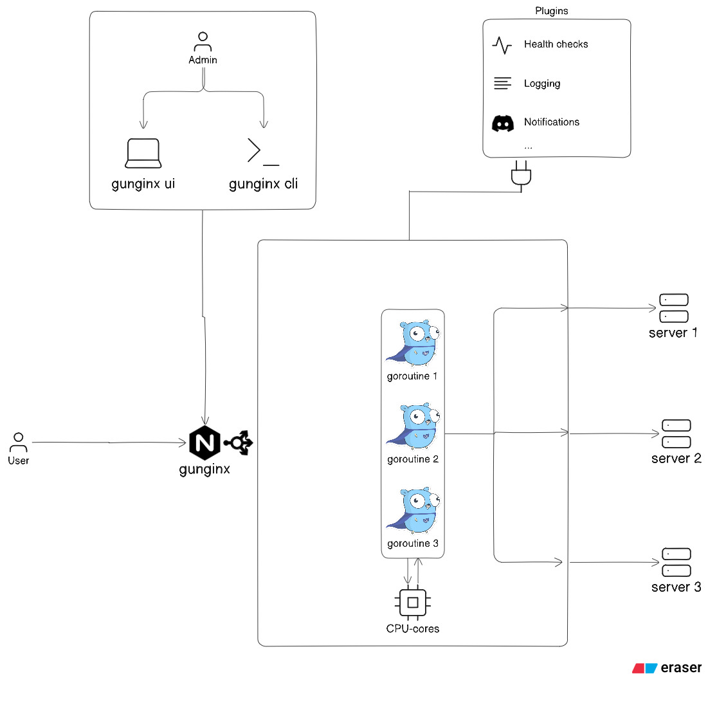

<div align="center">
  

# Gunginx

**A high-performance, highly extensible Load Balancer written in Go.**

[](https://github.com/gunginx/gunginx)
[](https://opensource.org/licenses/Apache-2.0)
[]()

</div>

---

## Overview

Gunginx is a hobby project to create a lightweight, strictly typed Reverse Proxy and Load Balancer from scratch. Designed with a "Build to Learn" philosophy for systems programming, it prioritizes memory efficiency, clean structural boundaries, and extreme extensibility.

Unlike monolithic load balancers, Gunginx features a Host-Guest architecture. The core routing engine is completely decoupled from middleware logic, allowing developers to inject custom plugins (like custom authentication, logging, or Discord alerts) securely into the request lifecycle.

## Core Features

* **Zero-Allocation Request Context:** Uses custom, type-safe structs for request metadata to minimize Garbage Collection (GC) pressure.
* **Concurrency Safe:** Engineered to safely manage shared state and handle high-throughput concurrent connections across multiple CPU cores without data races.
* **Robust Reverse Proxy:** Leverages native proxying capabilities for efficient byte streaming, chunked transfer encoding, and transparent protocol upgrades.
* **Pluggable Middleware Architecture:** A dedicated SDK (`pkg/sdk`) for building compile-time extensions.
* **Round Robin Load Balancing:** Distributes traffic evenly across a dynamic pool of upstream backend servers.

## Architecture

The system is strictly divided into a **Control Plane** (Configuration and state management) and a **Data Plane** (The high-speed traffic routing path).

<div align="center">
  
</div>

## Quick Start (Running Locally)

You can spin up Gunginx and observe the Round Robin load balancing in action using the included dummy backend servers.

**1. Start the dummy backend servers:**
Open three separate terminal tabs and run the following commands to simulate upstream microservices:
```bash
go run ./cmd/dummy-server/main.go 8081
go run ./cmd/dummy-server/main.go 8082
go run ./cmd/dummy-server/main.go 8083
```

**2. Start the Gunginx Daemon:**
In a new terminal, launch the load balancer:
```bash
go run ./cmd/gunginx-server/main.go
```

**3. Test the Load Balancer:**
Send traffic to port `8080`. You will see the requests distributed sequentially across your dummy servers.
```bash
curl http://localhost:8080
```

## Project Structure

Gunginx adheres strictly to the standard Go project layout to separate internal engine logic from public SDK contracts.

```text
gunginx/ 
├── go.mod
├── cmd/
│   ├── gunginx-server/
│   │   ├── main.go       <-- The core load balancer daemon
│   │   └── plugins.go    <-- Compile-time registry for enabling plugins
│   └── gunginx/          
│       └── main.go       <-- The CLI management tool (e.g., gunginx reload)
├── internal/
│   └── engine/           <-- Core load balancing logic (Round Robin, State Management)
├── pkg/
│   ├── api/              <-- Shared data structures
│   └── sdk/              <-- The Plugin SDK Contract (Middleware interfaces)
└── plugins/              <-- Out-of-the-box extensions
    ├── logger/           <-- Request logging middleware
    └── notify-discord/   <-- Alerting middleware
```

## Roadmap

**Phase 1: The Core Engine (Foundation & Stability)**
* [x] **v0.1: The Prototype** * TCP Listener, `httputil.ReverseProxy`, and Mutex-based Round Robin state.
* [ ] **v0.2: Core Resiliency (Safety Limits)**
    * Implement `ReadTimeout`, `WriteTimeout`, and `IdleTimeout` to prevent memory leaks from hanging backends.
    * Implement Graceful Shutdown (OS Signal listener) to finish active requests before exiting.
* [ ] **v0.3: High-Performance Routing**
    * Implement Active Retries (intercepting TCP `connection refused` and failing over to the next peer).
    * Configure `http.Transport` Connection Pooling (Keep-Alives) for low-latency backend communication.

**Phase 2: The Control Plane (Configuration)**
* [ ] **v0.4: Custom Configuration Compiler**
    * Write a custom Lexer and Parser for an Nginx-style `.gunginx` syntax.
    * Map the Abstract Syntax Tree (AST) to Gunginx's memory state.

**Phase 3: Extensibility & Ecosystem**
* [ ] **v0.5: The Plugin SDK**
    * Define middleware interfaces for request interception.
    * Implement dynamic plugin registration.
* [ ] **v0.6: Active Health Checks**
    * Build a background Goroutine worker (as a core plugin) to ping servers and dynamically update the Mutex pool state.

## License
This project is licensed under the Apache 2.0 License - see the LICENSE file for details.